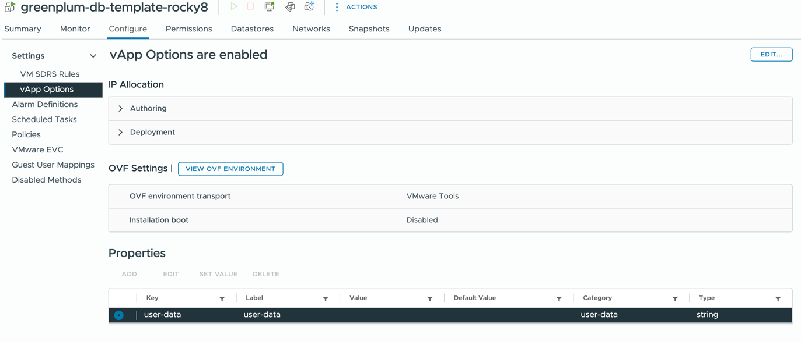

# Prepare rocky8 template

Install with defaults. execute following.

```
yum install perl open-vm-tools cloud-init cloud-utils-growpart wget -y
yum update -y

cat <<EOF > /etc/cloud/cloud.cfg.d/99-prep.cfg
disable_root: false
ssh_pwauth: true
network:
  config: disabled
disable_vmware_customization: true
datasource:
  OVF:
    allow_raw_data: false
datasource_list:
- OVF
- VMware
EOF
```

# Enable vApp Config



# Apply terraform
```
terraform plan -var-file=gp.tfvars
terraform apply -var-file=gp.tfvars
```

