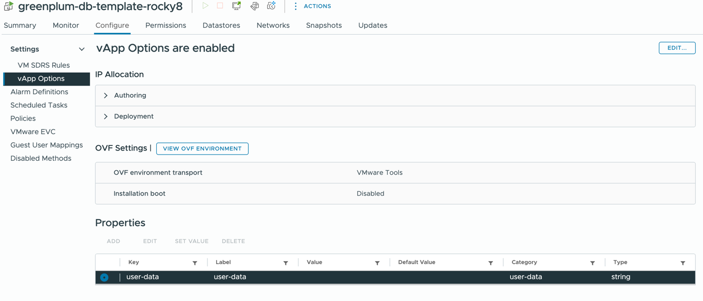

# Prepare rocky8 template

Install with defaults. execute following.

```
yum install perl open-vm-tools cloud-init cloud-utils-growpart wget -y
yum update -y

cat <<EOF > /etc/cloud/cloud.cfg.d/99-prep.cfg
disable_root: false
ssh_pwauth: true
network:
  config: disabled
disable_vmware_customization: true
datasource:
  OVF:
    allow_raw_data: false
datasource_list:
- OVF
- VMware
EOF
```

Clean up cloud init

```
cloud-init clean --logs
```


# Enable vApp Config



# Apply terraform
```
terraform plan -var-file=gp.tfvars
terraform apply -var-file=gp.tfvars
```

# Upgrade an already deployed cluster

`upgrade_to_78.sh` takes a cluster deployed from an older folder (gp77 and
before) to the gp78 state without redeploying: Rocky Linux 8 packages, Greenplum
7.8.3, GPCC 7.7.3 and every add-on the templates install. Copy it to cdw and run
it as root, the segment hosts are driven over gpssh/gpsync and never need
internet access of their own.

```
scp upgrade_to_78.sh gpadmin@cdw:/tmp/
ssh gpadmin@cdw
sudo -i
export PIVNET_API_TOKEN=<token>
bash /tmp/upgrade_to_78.sh
```

The database is stopped for the OS update and the rpm swap, so take a backup
first. Everything is logged to `/var/log/gp78_upgrade.log`.

Steps run in this order, and each one is idempotent:

| step | what it does |
| --- | --- |
| `preflight` | validates the host, prints current vs target versions, asks for confirmation |
| `download` | pulls every product file to `/home/gpadmin/gp_downloads`, skips what is already there |
| `checkcat` | `gpcheckcat -A`, the documented pre-upgrade catalog check, reports only |
| `stop` | backs up `$PXF_BASE` and stops PXF, `gpcc stop`, then the documented smart `gpstop -a` (falls back to `-M fast`) |
| `os` | `yum -y update` on every host, then reports which hosts want a reboot |
| `db` | `yum upgrade` of the 7.8.3 rpm, segments first, repoints the `greenplum-db` symlink explicitly, `chown -R gpadmin /usr/local/greenplum*`, restores the segment proxy config, and reports any custom line the old `greenplum_path.sh` had |
| `start` | `gpstart -a` and prints the running version |
| `gpdr` | greenplum-disaster-recovery on every host |
| `gpcc` | creates the GPCC home on every host first, then `gpccinstall -u` (reads the existing `app.conf`), then the documented metrics_collector recovery: drop the extension, `gppkg install`, restart the cluster |
| `pxf` | PXF from the `greenplum-pxf` product with Java 17, `pxf cluster register` / `sync` / `start`, then `ALTER EXTENSION pxf UPDATE` in every database that has it |
| `gpcopy` | gpcopy binaries into the new GPHOME |
| `dsp` | DataSciencePython gppkg plus the `pgml.venv` / `plpython3.python_path` GUCs |
| `madlib` `postgis` `plr` | the gppkgs, reinstalled because a GPDB upgrade replaces GPHOME |
| `gptext` | skipped automatically when the gptext tarball is not available |
| `gpmlbot` | pg_hba entries, gpmlbot database, extensions, migrations |
| `finish` | final `gpstop -M fast -ra`, `gpcc start` and a summary |

The procedures follow the Broadcom documentation:
[Greenplum minor upgrade](https://techdocs.broadcom.com/us/en/vmware-tanzu/data-solutions/tanzu-greenplum/7/greenplum-database/install_guide-upgrading_minor.html),
[GPCC upgrade](https://techdocs.broadcom.com/us/en/vmware-tanzu/data-solutions/tanzu-greenplum-command-center/7-1/gp-command-center/topics-install.html#upgrade),
[PXF 7.x to 8.x upgrade](https://techdocs.broadcom.com/us/en/vmware-tanzu/data-solutions/tanzu-greenplum-platform-extension-framework/8-0/gp-pxf/upgrade_7_to_8.html).

The core steps fail fast, the add-ons only warn so one bad package does not stop
the rest. To resume after fixing something:

```
./upgrade_to_78.sh --only gpcc,pxf      # just these
./upgrade_to_78.sh --skip download,os   # everything else
./upgrade_to_78.sh --list               # step names
```

Versions come from the same defaults as `common.tf` and can be overridden per
run, e.g. `GPTEXT_RELEASE_VERSION=3.10.2 ./upgrade_to_78.sh --only gptext`.

